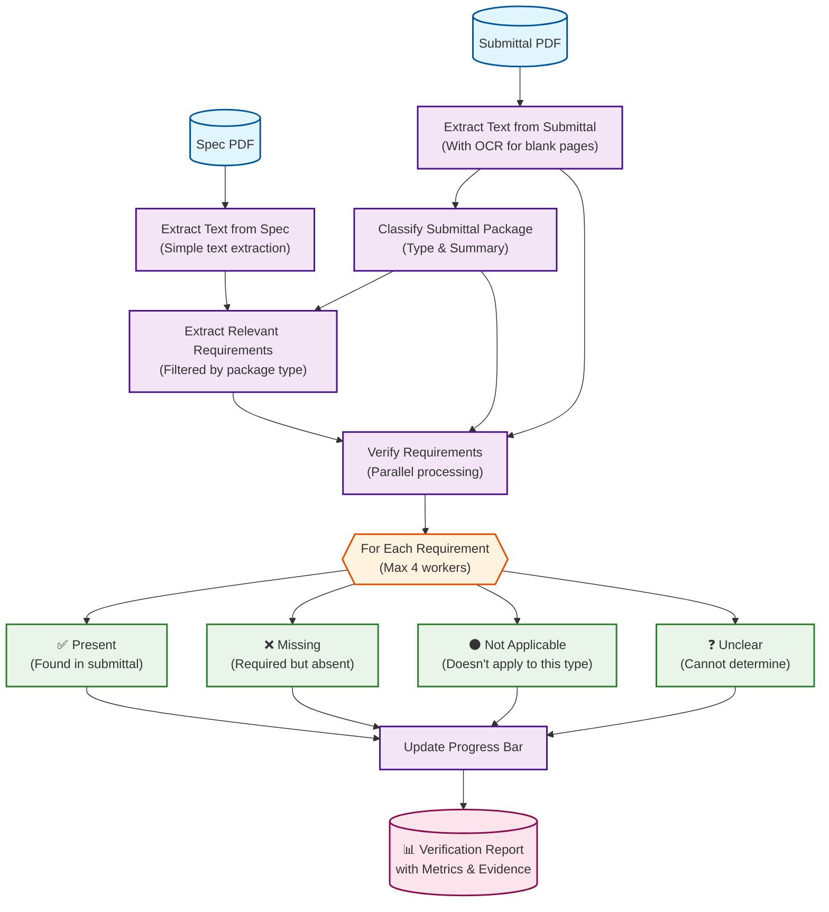

# GC Submittal Completeness Checker (Streamlit MVP)

Lightweight Streamlit app that extracts submittal requirements from a spec and verifies a submittal package using an LLM + OCR pipeline.

## Quick summary
- Purpose: classify submittal packages, extract relevant spec requirements, and verify package completeness.
- Target Python: 3.13 (see `.python-version`)
- Main files: `app.py` (UI + pipeline), `prompt_manager.py`, `prompts.json`, `pyproject.toml`.

## Requirements
- Python 3.13
- OpenAI API key (Responses + Vision access recommended)
- uv package manager

## Quickstart (macOS)
1. Install uv if needed:
```zsh
curl -LsSf https://astral.sh/uv/install.sh | sh
```

2. Install dependencies:
```zsh
uv sync
```

3. Add OpenAI key:
```toml
# .streamlit/secrets.toml
OPENAI_API_KEY = "sk-..."
```

4. Run app:
```zsh
uv run streamlit run app.py
```

## How it works (high level)
1. Upload spec PDF and submittal package (PDF/image).
2. Extract text from PDFs (PyMuPDF); blank pages can be OCR'd via OpenAI Vision.
3. LLM pipeline:
   - Classify package type & short summary
   - Extract relevant submittal requirements from spec (JSON checklist)
   - Verify each requirement against the uploaded package (status + evidence)

## Prompts & customization
- Prompts are in `prompts.json`. Edit to tune system/user instructions, output JSON shapes, or add new agents.
- `prompt_manager.py` loads and formats prompts.

## Troubleshooting
- "Please add your OpenAI API key" — ensure `.streamlit/secrets.toml` exists and contains `OPENAI_API_KEY`.
- LLM returns malformed JSON: parser attempts recovery but always review outputs manually.
- Rate limits: reduce parallel calls (see `verify_submittal_parallel`) or run sequentially.

# Submittal Verifier GC

## Process Flow

